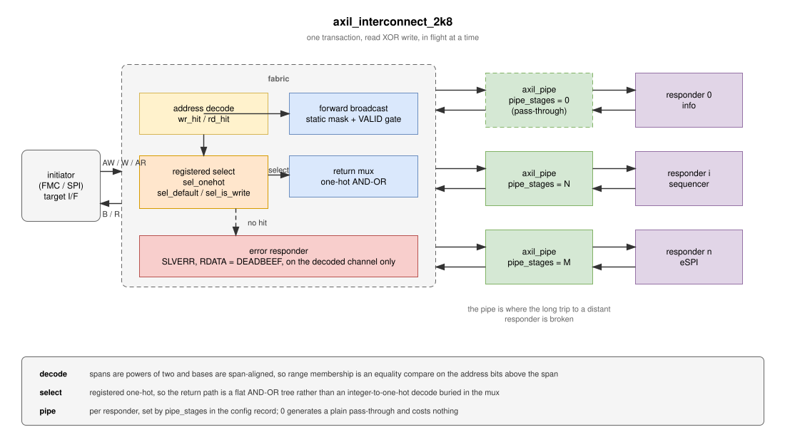
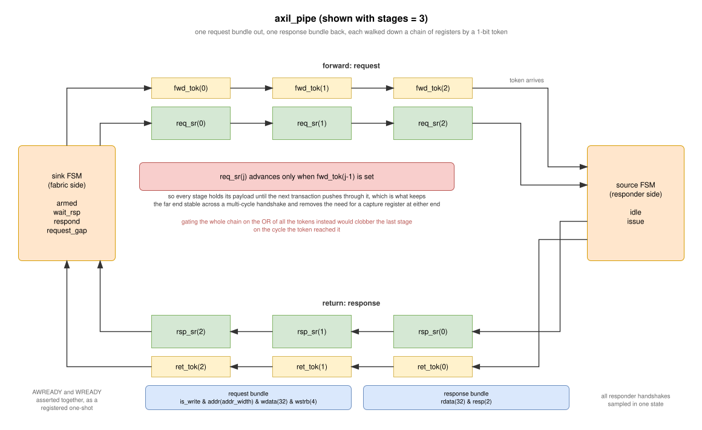

:showtitle:
:toc: left
:numbered:
:icons: font
:revision: 1.0
:revdate: 2026-08-05

= AXI-Lite Interconnect

`axil_interconnect_2k8` is the shared register-access fabric used by cosmo_seq, grapefruit and
cosmo_hp. One initiator (the FMC target on the Spartan-7 designs, the SPI AXI controller on
cosmo_hp) reaches a handful of responders, each of which owns a power-of-two slice of the address
space.

`axil_interconnect` is a thin VHDL-2019 wrapper that presents the same thing with interface views;
all of the logic lives in the 2008 flat-port entity so that cosmo_hp, which builds through GHDL and
yosys, can use it too.

== Overview

The single most important property of this block, and the one everything else leans on:

[IMPORTANT]
====
Exactly one transaction, read *or* write, is in flight at a time. A registered decode stage selects
a responder, the transaction runs to completion, and only then is the fabric torn down and re-armed.
====

Both initiators cooperate with this — each dispatches a read or a write from an idle state and does
not return to idle until B or R has landed, and neither ever asserts `AWVALID` and `ARVALID`
together.

=== Address decode

Every responder base address is aligned to its own span, and every span is a power of two. That
makes "is this address inside the range" equivalent to "do the address bits above the span match the
base", which is a plain equality compare rather than the pair of magnitude compares (and their carry
chains) that a base/limit check would build.

[source,vhdl]
----
wr_hit(i) <= '1' when ((wr_addr32 xor config_array(i).base_addr) and not span_mask(span)) = ZERO32
             else '0';
----

The compare is deliberately over the full 32 bits of a *resized* address. Narrowing it to the
initiator's own width would let a 16-bit initiator falsely match a base it has no way to drive; the
extra bits compare against constant zeros and fold away in synthesis.

The invariants this relies on are checked at elaboration by `bases_aligned`, `ranges_disjoint` and
`bases_reachable` in `axil_common_pkg`, so a bad map is a build error rather than a silent misroute.

=== Responder select

The select is a registered *one-hot* vector, `sel_onehot`, one bit per responder, plus a separate
`sel_default` bit for the catch-all. Keeping it one-hot rather than an integer index means the
return path is a flat AND-OR tree; an integer index forces synthesis to build an
integer-to-one-hot decoder inside the combinational mux.

A write is only decoded once `AWVALID` *and* `WVALID` are both on the bus. That is the same
condition every responder already applies before asserting `AWREADY` (see `axil_target_txn`), and it
keeps a lone `AWVALID` from arming the fabric.

Teardown takes priority over arming, and re-arming is blocked per channel until the initiator drops
the request it just completed. Initiators here deassert VALID one cycle *after* the handshake, so
without that guard a stale request re-arms the fabric and a duplicate transaction goes out behind
the initiator's back. The guard is tracked separately for reads and writes so that a permanently
asserted `AWVALID` cannot block reads.

=== Error responder

When no responder matches, `sel_default` is set instead of any bit of `sel_onehot`, and the fabric
answers by itself: `SLVERR`, with `RDATA` of `0xDEADBEEF` on reads. It answers only the channel that
was actually decoded, tracked by `sel_is_write`, so an unmapped read cannot hand an `AWREADY` to a
write that has not presented its data yet.

Because the response is registered, an unmapped access costs the same one cycle of decode plus one
cycle of response as a mapped access to a fast responder. It never stalls, which is the entire point
of having it.

== Pipelining

Adding pipeline stages is how a responder that sits a long way from the fabric stops having to be
reached *and* answered inside a single clock period. Each responder gets its own depth, set by
`pipe_stages` in the config record:

[source,vhdl]
----
constant config_array : axil_responder_cfg_array_t :=
    (INFO_RESP_IDX => resp_cfg(base_addr => x"00000000", addr_span_bits => 8),
     ...
     ESPI_RESP_IDX => resp_cfg(base_addr => x"00008000", addr_span_bits => 15, pipe_stages => 1));
----

`pipe_stages = 0` generates a plain pass-through and costs nothing, so the knob is free where it is
left alone.

=== Why it is not five register slices

The obvious implementation is a register slice per AXI channel, which for AW/W/B/AR/R means five
independent sets of valid/ready control and roughly 292 flops per stage per responder.

Because the fabric admits one transaction at a time, `axil_pipe` does not need that. The whole
transaction serializes into *one* request bundle going out and *one* response bundle coming back:

[cols="1,3"]
|===
| request bundle | `is_write & addr(addr_width) & wdata(32) & wstrb(4)`
| response bundle | `rdata(32) & resp(2)`
|===

Only the address bits the responder actually decodes are carried, so an 8-bit responder pipes 45
bits rather than a 32-bit address. That lands at roughly a third of the flops of a pair of full
register slices, with a single 1-bit token chain instead of five sets of handshake control.

Deliberately, no timing exceptions are required. cosmo_hp builds through yosys and nextpnr, where
there is no way to express a `set_multicycle_path`, so an approach that leaned on constraints would
have bought nothing on the one design whose critical path was actually in this block.

=== How the chain advances

Each payload stage advances *only behind its own token*:

[source,vhdl]
----
for j in stages - 1 downto 1 loop
    fwd_tok(j) <= fwd_tok(j - 1);
    if fwd_tok(j - 1) = '1' then
        req_sr(j) <= req_sr(j - 1);
    end if;
end loop;
----

That is what makes every stage hold its payload until the next transaction pushes through it, which
in turn keeps the far end of the chain stable across a multi-cycle handshake — and that is why no
separate capture register is needed at either end. Stage 0 *is* the sink's capture register and
stage `stages-1` *is* the source's.

[WARNING]
====
Gating the whole chain on the OR of all the tokens instead would clobber the last stage on the cycle
the token reached it, corrupting the payload the source FSM is still driving.
====

The payload chain is deliberately left resetless — only the tokens come up clean — which on 7-series
also lets Vivado map it to SRLs.

=== The two ends

The *sink* FSM (`armed`, `wait_rsp`, `respond`, `request_gap`) faces the fabric. It accepts a write
only when `AWVALID` and `WVALID` are both present and asserts `AWREADY` and `WREADY` together in the
same cycle, as a registered one-shot — never combinationally off `AWVALID`, which would create a
path straight back to the initiator that does not exist today. It captures `WDATA` on acceptance
because the FMC target's write-data FIFO pops on the W handshake and the data is not valid
afterwards. It will not re-arm until the request that just completed is off the bus.

The *source* FSM (`idle`, `issue`) faces the responder. It tracks the AW and W handshakes separately,
because responders are free to accept them independently, and samples every handshake in one state.
That last part matters: `axil_target_txn` presents `BVALID` as a single-cycle pulse when `BREADY` is
already asserted, and `ARREADY` combinationally as `not rvalid`, so a dedicated wait-for-response
state would miss both and hang.

=== Latency

Round trip is `2 * pipe_stages` cycles plus a few fixed handshake cycles. Measured by the
`pipe_latency` testbench case, as clocks from `ARVALID` to `RVALID`:

[cols="1,1"]
|===
| `pipe_stages` | read latency

| 0 | 2 clocks
| 1 | 6 clocks
| 2 | 8 clocks
|===

Each additional stage costs exactly 2 clocks; the step from 0 to 1 also picks up the pipe's fixed
handshake overhead. At 125 MHz one stage is about 40 ns of extra SP bus stall per access, which the
FMC covers with wait states — but it is a real cost, so raise `pipe_stages` only where timing needs
it and re-measure.

== Simulation

`buck2 run //hdl/ip/vhd/axi_blocks:axil_interconnect_tb`

The harness drives the flat-port entity with a mixed responder map (pipe depths 0, 1, 3 and 2, plus
a deliberately unmapped hole) and can be driven either by `vunit_lib.axi_lite_master` or by hand, so
the testbench can reproduce initiator handshake patterns the bus functional model never generates.

Two responder models with deliberately different handshake shapes:

* `axil_sram_responder` wraps the production `axil_target_txn`, so it reproduces the contract every
  register block in the tree presents.
* `axil_slow_responder` accepts AW and W independently after LFSR-driven stalls and holds its
  responses until READY — a shape nothing in the tree currently exercises.

The harness also counts handshakes on both sides of the fabric, so a duplicated transaction is
caught even when the data happens to land correctly, and checks that a stalled channel's payload
stays put.

[NOTE]
====
`write_axi_lite` only *queues* a write; it does not block. Call `wait_until_idle` before taking the
bus over by hand or before sampling the handshake counters.
====

== Things worth knowing

* A concurrent read and write from one initiator is serialized, not run in parallel. Neither
  initiator does this today.
* `axil_interconnect` hard-codes a 26-bit initiator. A differently sized initiator needs either the
  2008 entity directly (as cosmo_hp does) or a new wrapper.
* Registering B and R at the *initiator* boundary would cut the remaining combinational return mux,
  but `RDATA` cannot be registered without also delaying `RVALID`, which would cost a cycle for
  every responder including the unpiped ones. If it is ever needed it belongs behind its own
  generic, not `pipe_stages`.
