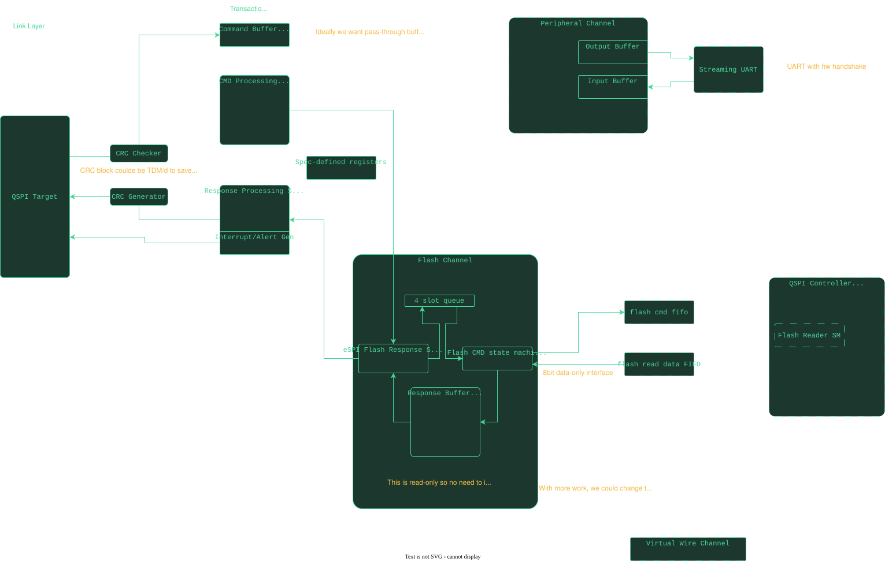

:showtitle:
:toc: left
:numbered:
:icons: font
:revision: 1.0
:revdate: 2024-04-24

= eSPI Target Core

This block implements an eSPI target core. It is intended to provide SAFS (Slave attached Flash Storage)
boot functionality for an SP5-class AMD processor. It is intended to support single, dual and quad I/O Modes
at 66MHz which is the espi-spec maximum frequency. The actual internal fabric is intended to run at >3x the
SPI frequency so we shoot for 200MHz here.

== Overview

=== Link Layer

This block deals with the physical layer of the eSPI interface and contains the serializer/deserializer
and qspi I/O.  Sampled data is sent to the command processor (transaction layer) with a byte-wide streaming
interface via a CDC FIFO.  Responses from the response processor (transaction layer) are received via a
byte-wide streaming interface (through CDC FIFO) and shipped out the serializer.

==== Source-synchronous serdes

The serdes is clocked directly by the eSPI SCLK rather than being oversampled in the
fabric domain. Oversampling put a fixed ~10-16ns between a real SCLK edge and the
resulting sample or launch, which is a whole half-period at 50MHz and beyond -- and was
already close to failing on the output path at 20MHz. That latency cannot be reduced:
one flop is the minimum on an asynchronous input, and the sample granularity is fixed by
the fabric clock.

The split is along the line of what has to keep working when SCLK is not running:

* `espi_phy` -- shift registers, the command sizer, and the command/turnaround/response
  phase state machine. Clocked by SCLK, with chip select as an asynchronous domain reset.
  Keeping the sizer here means the phase boundary is exact and never crosses a domain; a
  crossed phase decision would carry a cycle of uncertainty, which at 66MHz is most of a
  bit time.
* `link_txn_bookkeeper` -- byte handoff, WAIT_STATE insertion, and in-band reset
  detection, in the fabric domain. In-band reset is recognised here rather than in the
  sizer because it has to be reported when chip select rises, and there is no SCLK edge
  left at that point to clock it out.
* `resp_byte_xfifo` -- a small gray-pointer asynchronous FIFO carrying response bytes
  into the SCLK domain. `dcfifo_xpm` cannot be used for this: its reset needs cycles of
  both clocks, and SCLK stops between transactions, so a reset issued while idle would
  never retire. This one takes an asynchronous clear from chip select instead.

The packet FIFOs and the alert generator stay in the fabric domain.

===== Sizer latency and the opcode fast path

The sizer needs three SCLK to raise `valid` after a byte completes: one for the byte
strobe to land and two state transitions. That was free when it ran at 200MHz, but these
are now SCLK periods. A two-byte command such as GET_STATUS is 16 SCLK in single mode and
8 in dual, so there is room -- but only 4 in quad, which is too late to place the
turnaround.

For every command whose length follows from the opcode alone, the answer is known the
moment the first byte lands, so `espi_phy` takes that combinationally and leaves the
sizer to the commands that carry a length in their header. Those are long enough that its
latency does not matter.

The fast path must skip the in-band reset opcode. It appears in
`known_size_by_opcode` but has no length, and `size_by_header` rejects it outright --
`cmd_sizer` gets away with this only because it tests for reset *before* it consults the
size tables. Excluded from the fast path, a reset falls through to the sizer, which routes
it to the in-band reset handling and never produces a response.

===== In-band reset returns the link to its defaults

An in-band reset restores the whole capability register, which means the negotiated I/O
mode and frequency go back to single and 20MHz along with everything else. A controller
that was running quad at 66MHz has to follow the target back down, or the two ends
disagree about how to interpret the next transaction. This is spec behaviour rather than
anything specific to this implementation, but it is easy to miss.

This is the only block expected to run in the faster clock domain.  To realize this, functionality,
we're leveraging the eSPI "WAIT_STATE" feature on every response, which allows us cycles to get from
the fast domain to the slow domain with the command packets, and have a couple of slow-domain cycles
to push responses back into the response FIFO before they are needed.

The number of wait states depends on the speed and bus-width of the eSPI interface.  We make decisions
in the slow domain based on the register settings and then propagate those decisions to the fast domain
as a wait-state count, using a simple cross-domain bus interface.
These wait states are inserted automatically at the link layer by the 
target, so the transaction layer doesn't need to worry about them.

The physical-layer will also insert 0xFFs if the FIFO is empty. This serves
2 purposes:
- It provides the ERROR response if the target chooses not to respond
- It raises the qspi lines to '1' at the final shift, which is needed by
the specification.

==== Turn around analysis

The cross-domain FIFOs take some cycles for data to propagate. Xilinx shows 1 wr-clk + 6 rd-clk cycles for data to propagate from one side to the other. Assuming the fast domain is at 200MHz and the slow domain is at 125MHz that results in a prop-delay of 5ns + 6*8ns = 53ns. The response
path will be slower since the read clock is faster but we can use this number as a rough estimate each way since we're trying to calculate how
many wait states we need to insert worst-case. Assigning 4 slow clocks to
do operational logic, we arrive at a turn-around time of 53ns * 2 + 32 ns = 138ns. Each WAIT_STATE will count as a byte-time, so this changes based
on the bus width and speed. Our worst-case here is quad mode, 66MHz so we have 2 clks/byte = 33ns/byte. We have 138ns / 33ns = 4.18 bytes rounding up to 5 waits.

We can do the same calculation for each of the speeds/modes resulting in this table:
5 wait states for quad mode, 66MHz
3 wait states for dual mode, 66MHz
2 wait states for single mode, 66MHz
4 wait states for quad mode, 50MHz
2 wait states for dual mode, 50MHz
1 wait state for single mode, 50MHz
3 wait states for quad mode, 33MHz
2 wait states for dual mode, 33MHz
1 wait state for single mode, 33MHz
2 wait states for quad mode, 25MHz
1 wait state for dual mode, 25MHz
1 wait state for single mode, 25MHz
2 wait states for quad mode, 20MHz
1 wait state for dual mode, 20MHz
1 wait state for single mode, 20MHz

The physical-layer inserts these wait states automatically before fetching
from the response FIFO as they are not counted in the CRC generation.

==== Measuring the wait state table

The derivation above is an estimate, and moving the serdes into the SCLK domain added a
handoff it does not account for. So the table is measured rather than derived:
`wait_states_from_freq_and_mode` is forced to a constant and the `mode_freq_sweep_*` tests
run at each value from 0 to 6. Too few wait states makes the link layer pad the response
with 0xFF, which shows up immediately as a CRC mismatch.

The sweeps report every configuration and fail once at the end rather than halting on the
first bad one, so a single run yields the whole matrix. Two things are easy to get wrong
here and both were, at first:

* The configuration change itself runs at the *previous* configuration's mode and speed,
  so its result has to be attributed there and not to the configuration being moved to.
  Otherwise every configuration inherits its predecessor's failure.
* VUnit suppresses log output for passing tests, so the runs where everything worked
  silently produced no data at all. The sweep needs `-v`.

Measured minimum, with all three sweeps agreeing on every entry:

....
             20MHz  25MHz  33MHz  50MHz  66MHz
single           1      1      1      1      2
dual             1      1      1      2      3
quad             1      2      2      4      5
....

Twelve of the fifteen sat exactly on the boundary against the previous table, so the table
is now that measured minimum **plus one byte-time of margin**:

....
             20MHz  25MHz  33MHz  50MHz  66MHz
single           2      2      2      2      3
dual             2      2      2      3      4
quad             2      3      3      5      6
....

What the margin is for is worth being precise about, because it is not protecting against
the simulation being wrong about the hardware. The FIFO and handoff latencies are
deterministic and the simulation models them exactly. What is *not* covered is the
transaction layer taking longer to produce a response for some command the sweep does not
exercise -- it only drives GET_STATUS, GET_CONFIGURATION and flash reads. The "4 slow
clocks to do operational logic" in the derivation above is still an assumption, and a
byte-time of margin buys roughly that much slack back at the frequencies where it is
tightest.

The cost is one byte-time per response, about 1.4% of a 64-byte flash read at any
frequency, since both the margin and the payload scale together.

NOTE: `max_wait` (GENERAL_CAPABILITIES bits 15:12) is the controller telling the target the
most WAIT_STATE bytes it will tolerate, and this design ignores the field. The reset value
of 0 means 16, so the default is fine, but a controller that sets it between 1 and 5 would
be violated at quad/50MHz and quad/66MHz. Clamping to it is not obviously right either --
sending fewer wait states than the round trip needs corrupts the response, which is worse
than sending too many -- so the honest fix is to refuse the mode/frequency combination
rather than to clamp.

=== Debug Interface
We can enable a debug interface that muxes the streaming interfaces away from the serdes blocks and connects
them to FIFOs that are accessible via the AXI bus. This allows software to inject eSPI commands and capture
eSPI responses without needing an eSPI master connected in the system. With some minor modifications, this 
could also be used to log eSPI traffic when a real eSPI master is connected for debugging purposes.

=== Transaction Layer

At the transaction layer, the command processor is responsible for "parsing" the input stream and taking
action based on the command. The response processor is responsible for generating the response stream.

There are CRC blocks for the tx and rx paths. The CRC is calculated on the fly and is shipped out at the
appropriate time. Note that the eSPI master must *enable* CRC enforcement in the slave in order for this
block to actually enforce CRCs, otherwise it will accept any correctly formed packet.

=== Uart Channel
Use the posted peripheral interface to send and receive data on a uart channel. Right now we support a single
UART channel, but this could be expanded to support 2 channels using two different tags. We have a simplified
design here in that the data streams directly to a FIFO which may be undesirable if we are expecting CRC issues
in which case we'd need an additional buffer an only process data once the crc is verified.

=== Flash Channel
We implement the read commands of SAFS. We do not implement the write commands. The flash channel is a non-posted
block with 4 1024kB queue entries. It issues read requests to the eSPI flash block and then waits for the response,
once flash response data is enqueued it will alert the host that completed data is available and the host can
issue a non-posted GET to read the data.

== Simulation Environment
The simulation environment provides both a qspi master verification component
that wiggles the qspi lines like a spi master would, but can also leverage
the built-in debug interface to send arbitrary commands to the eSPI target
and get responses back at the byte-streaming layer. This logic can be utilized
for hardware-in-the-loop testing of the eSPI target core.

The "flash" block is a simple fake interface that behaves like our spi nor
controller with respect to reading so that we didn't have to build in a hard dependency
on that block here.

We do pull the FIFO'd UART in because it was simple to do so and then put the
UART in loopback mode so that tx => rx.

== Things not implemented
We don't adapt the response code and send data back after get_status currently. This would be 
a minor modification and efficiency improvement but is not strictly necessary for basic functionality.

=== Flash Write over eSPI interface
In our system our security model is such that we provide a read-only flash interface to the SP5 processor.
Any attempts to write the flash from the SP5 will be returned with a FATAL ERROR. This is a security feature
of our sleds, and not something we plan to support. The SP will be able to read/write flash and then will hand
off the flash to the SP5 and this espi interface.

=== UART interface
We provide a UART interface using the Peripheral channel and MESSAGE_WTIH_DATA cycle type for bidrectional
communication. The block alerts the host via the alert mechanism when data is available to be read. There 
are no thresholds or timeouts here so one or more bytes sitting in the FIFO causes an alert, but we 
always send the maximum available data (up to the max message size). We can evaluate adding
some thresholding if that would help efficiency we can add those if necessary.

