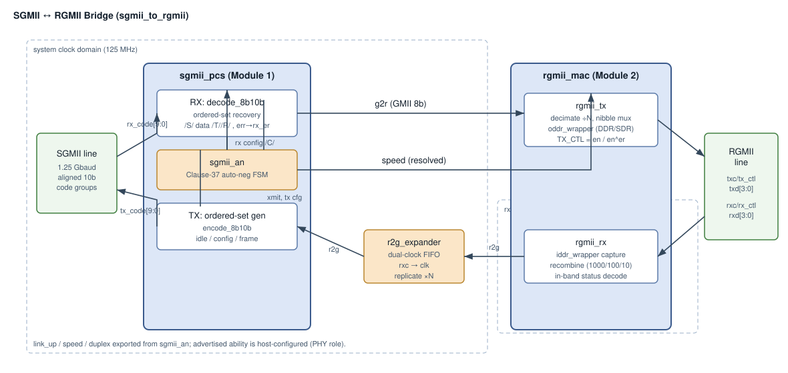
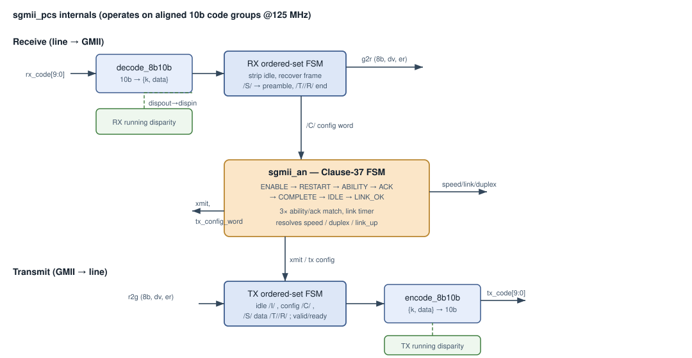
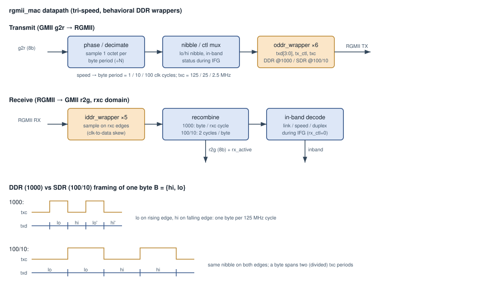
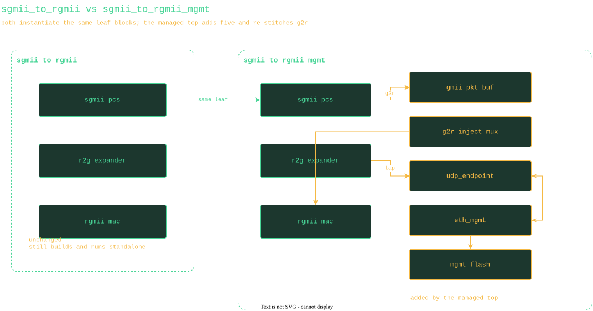
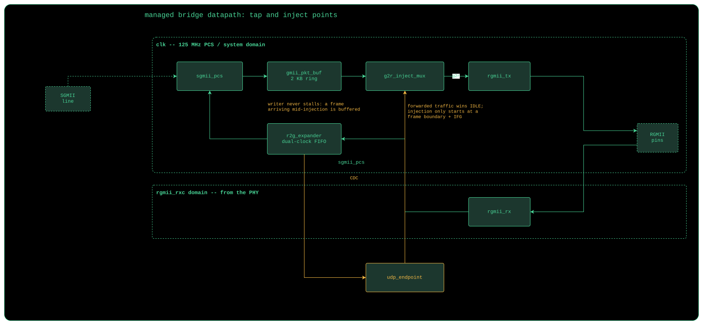
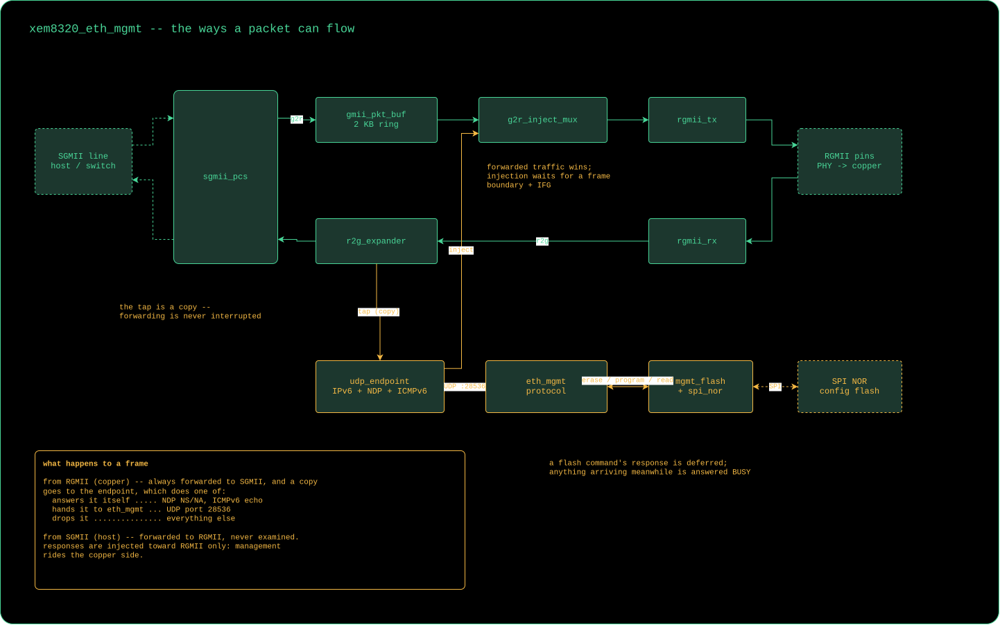

:showtitle:
:toc: left
:numbered:
:icons: font
:revision: 1.0
:revdate: 2026-06-09

= SGMII &#8596; RGMII Bridge

This block is a media converter that translates between *SGMII* (a serial, 8B10B-coded
gigabit interface) and *RGMII* (a 4-bit DDR parallel interface). It lets an upstream SGMII
MAC talk to an RGMII PHY, or vice-versa, at 10/100/1000 Mbps. The design is split into two
modules that stitch together over an internal 8-bit GMII bus, plus a thin top that wires
them and crosses the receive clock domain.

The SGMII line side assumes the system already presents *comma-aligned 10-bit code groups*
at 125 MHz (i.e. an external SerDes/transceiver performs the 1.25 Gbaud bit-level
serialization and comma alignment). This block implements the PCS and rate-adaptation
logic, not the bit-level recovery.

== Overview

Data flows in both directions:

* *SGMII &#8594; RGMII*: aligned code groups enter the PCS receiver, are 8B10B-decoded into a
  GMII octet stream (`g2r`), and the RGMII transmitter drives them onto the DDR link.
* *RGMII &#8594; SGMII*: DDR nibbles are captured by the RGMII receiver, recombined into a GMII
  octet stream (`r2g`), crossed into the system clock domain by a small FIFO, and the PCS
  transmitter 8B10B-encodes them back onto the SGMII line.

`sgmii_pcs` runs auto-negotiation and resolves the link speed; that speed drives the RGMII
rate adaptation. Everything except the RGMII receive pin logic lives in a single 125 MHz
clock domain.

=== Background

*SGMII* is the Cisco-defined gigabit interface based on the IEEE 802.3 Clause 36
(1000BASE-X) PCS running at 1.25 Gbaud, with the Clause 37 auto-negotiation reused to carry
an SGMII-specific config word (speed/duplex/link). Bytes are 8B10B-coded into 10-bit code
groups; ordered sets delimit packets (`/S/` start, `/T/` `/R/` end, `/V/` error) and idle
(`/I1/` `/I2/`). At 100/10 Mbps each octet is replicated 10&#215;/100&#215; on the line.

*RGMII* carries 4 data bits on *both* edges of a forwarded clock: 125 MHz DDR for 1000 Mbps,
and 25/2.5 MHz SDR (the same nibble on both edges) for 100/10 Mbps. `TX_CTL`/`RX_CTL` carry
`enable` on the rising edge and `enable XOR error` on the falling edge. During the
inter-frame gap the PHY drives in-band link status (link/speed/duplex) on the data nibble.

=== The GMII stitch and the rate model

The two modules connect over a single 8-bit GMII bundle per direction
(`gmii_t` = `{data, dv, er}`, see `gmii/gmii_pkg.vhd`):

* `g2r` &#8212; octets decoded from the SGMII line, handed to the RGMII transmitter.
* `r2g` &#8212; octets recovered from the RGMII line, handed to the SGMII transmitter.

The SGMII line is always 1.25 Gbaud (one code group per 125 MHz tick) regardless of speed.
Speed is handled purely by *replicate / decimate*, so the GMII clock never slows; at 100/10
Mbps a "byte period" is simply 10/100 system-clock cycles. The PCS is deliberately
*rate-agnostic* &#8212; it always emits one code group per octet &#8212; and all rate adaptation lives
at the RGMII&#8596;GMII boundary, matching how a real SGMII PCS behaves (the MAC, not the PCS,
replicates).

== Module 1 &#8212; SGMII PCS (`sgmii/`)

`sgmii_pcs` wires three sub-blocks and exposes the GMII stitch plus the resolved
speed/duplex/link status.

=== Receive (`sgmii_pcs_rx`)

The aligned 10-bit code group feeds the combinational `decode_8b10b`
(`//hdl/ip/vhd/8b10b`), which yields `{k, data}` plus code/disparity error flags. The
running disparity is registered each cycle and fed back as the next decode's disparity in.

A receive ordered-set state machine then:

* strips idle ordered sets (`/K28.5/` + `/D5.6/` or `/D16.2/`);
* on `/S/` (K27.7) regenerates the first preamble octet (`0x55`) and starts a frame,
  streaming subsequent data octets onto `g2r`;
* ends the frame on `/T/` (K29.7), dropping `/R/` (K23.7) carrier-extend;
* maps `/V/` (K30.7) and decode errors to `rx_er`;
* extracts `/C/` config ordered sets (`/K28.5/` + `/D21.5/` or `/D2.2/` + two config bytes)
  and forwards the 16-bit config word to auto-negotiation.

=== Transmit (`sgmii_pcs_tx`)

Driven by the auto-neg `xmit` mode, the transmit ordered-set machine emits:

* `XMIT_CONFIG` &#8594; `/C1/` `/C2/` config ordered sets carrying the SGMII config word;
* `XMIT_IDLE` &#8594; `/I1/` `/I2/` idle ordered sets (the variant chosen to keep running
  disparity negative);
* `XMIT_DATA` &#8594; idle until `gmii.dv`, then `/S/`, data octets, `/T/`, `/R/`.

The chosen `{k, data}` code byte feeds the combinational `encode_8b10b`; the running
disparity is registered. The GMII input uses a combinational valid/ready handshake
(`gmii_ready`): the first frame octet (a preamble byte) is accepted and replaced by `/S/`.

=== Auto-negotiation (`sgmii_an`)

A Clause-37 state machine (`ENABLE &#8594; RESTART &#8594; ABILITY &#8594; ACK &#8594; COMPLETE &#8594; IDLE &#8594;
LINK_OK`) exchanges `/C/` config ordered sets. It matches the partner's advertised ability
over three consecutive receptions (ignoring the acknowledge bit), echoes acknowledge,
waits out a link timer, and resolves speed/duplex/link from the received config word. The
link timer (`LINK_TIMER_CYCLES`, 10 ms &#8776; 1.25M cycles at 125 MHz) is shortened by
testbenches. Auto-neg can be bypassed (`INCLUDE_AUTONEG = false`) to force the link up at
the advertised ability.

== Module 2 &#8212; RGMII adapter (`rgmii/`)

=== Transmit (`rgmii_tx`)

A free-running phase counter divides the 125 MHz clock into byte periods (1/10/100 cycles)
and decimates the `g2r` stream by sampling one octet per byte period. At 1000 Mbps the low
nibble is launched on the rising edge and the high nibble on the falling edge (true DDR); at
100/10 Mbps the selected nibble is presented on both edges (SDR) and a byte spans two
divided `txc` periods. `TX_CTL` carries `tx_en` / `tx_en XOR tx_er`. During the inter-frame
gap the transmitter drives the in-band status nibble (link up, resolved speed/duplex).

=== Receive (`rgmii_rx`)

Clocked by the received `rxc`, the `iddr_wrapper` instances sample `rxd`/`rx_ctl` on both
edges. The recombination logic assembles a byte per `rxc` cycle at 1000 Mbps, or across two
cycles at 100/10 Mbps (aligned to the rising edge of `RX_CTL`). `rx_dv`/`rx_er` come from
the control bits; during the inter-frame gap the rising-edge nibble is decoded into the
in-band link status. `r2g` and a `rx_active` frame indicator are produced in the `rxc`
domain.

=== DDR I/O wrappers (`rgmii/ddr/`)

`oddr_wrapper` / `iddr_wrapper` isolate the vendor-specific DDR registers. Only the
behavioral `SIM` model is implemented today: the input wrapper applies the RGMII
clock-to-data skew (a `CLK_DELAY` generic) so the sampling edges land inside the data eye,
making behavioral loopback race-free. `generate` branches are reserved for Xilinx
`ODDR`/`IDDR` and Lattice `ODDRX1F`/`IDDRX1F` primitives, to be filled in per board target.

== Bridge top and the rate expander (`sgmii_to_rgmii/`)

`sgmii_to_rgmii` instantiates both modules, routes the PCS-resolved `speed` into the RGMII
rate logic, and connects the two GMII busses. The forward (`g2r`) path is entirely in the
system clock domain. The return (`r2g`) path must cross from the `rxc` domain to the PCS
clock domain *and* reconstruct a continuous, replicated octet stream &#8212; the rate-agnostic
PCS treats any gap in `dv` as end-of-frame.

`r2g_expander` does both jobs with a small gray-coded *dual-clock FIFO*: the RGMII receiver
writes recovered octets on `rxc`; the read side, in the system clock domain, offers each
octet to the PCS for `speed_cycles_per_byte` accepts (honoring `gmii_ready`) before popping.
This decouples the rates and produces the 10&#215;/100&#215; replication the SGMII line needs at
100/10 Mbps (a no-op at 1000).

[NOTE]
====
The `rxc` &#8594; `clk` handoff assumes `rxc` is synchronous to `clk`, which holds when this bridge
sources the RGMII clock (the common media-converter topology). When receiving from an RGMII
PHY with a fully independent `rxc`, a deeper asynchronous FIFO belongs at this boundary. The
gray-coded FIFO already in `r2g_expander` is structured for that upgrade.
====

== Speed / rate adaptation summary

[cols="1,1,1,1,1", options="header"]
|===
| Speed | SGMII line | Octet replication | RGMII clock | RGMII framing
| 1000  | 1.25 Gbaud | 1&#215;              | 125 MHz     | DDR (lo rising, hi falling)
| 100   | 1.25 Gbaud | 10&#215;             | 25 MHz      | SDR (nibble both edges)
| 10    | 1.25 Gbaud | 100&#215;            | 2.5 MHz     | SDR (nibble both edges)
|===

== Source map

[cols="1,2", options="header"]
|===
| Path | Contents
| `gmii/gmii_pkg.vhd`              | GMII bundle, `eth_speed_t`, speed encodings
| `sgmii/sgmii_pkg.vhd`           | ordered-set codes, AN states, config-word pack/unpack
| `sgmii/sgmii_pcs*.vhd`          | PCS top, RX, TX
| `sgmii/sgmii_an.vhd`            | Clause-37 auto-negotiation FSM
| `rgmii/rgmii_pkg.vhd`           | RGMII pins, in-band status encode/decode
| `rgmii/rgmii_{mac,tx,rx}.vhd`   | RGMII adapter top, transmit, receive
| `rgmii/ddr/{o,i}ddr_wrapper.vhd`| behavioral DDR I/O wrappers (vendor hooks)
| `sgmii_to_rgmii/sgmii_to_rgmii.vhd` | bridge top
| `sgmii_to_rgmii/r2g_expander.vhd`   | dual-clock FIFO + replication
|===

== Testing

VUnit testbenches follow the repo's `*_tb.vhd` / `*_th.vhd` + `vunit_sim` pattern.

[cols="1,2", options="header"]
|===
| Target | Coverage
| `//hdl/ip/vhd/ethernet/sgmii:sgmii_pcs_tb`
  | line looped back on itself: auto-neg link-up, frame loopback, back-to-back frames,
    error propagation
| `//hdl/ip/vhd/ethernet/rgmii:rgmii_mac_tb`
  | RGMII pins looped back: 1000/100/10 frame loopback, in-band status decode
| `//hdl/ip/vhd/ethernet/sgmii_to_rgmii:sgmii_to_rgmii_tb`
  | full bridge with a second PCS as the SGMII link partner and the RGMII pins looped;
    end-to-end frame round-trip at 1000/100/10
|===

[source,console]
----
# run a whole testbench
buck2 run //hdl/ip/vhd/ethernet/sgmii_to_rgmii:sgmii_to_rgmii_tb

# run a single case
buck2 run //hdl/ip/vhd/ethernet/sgmii:sgmii_pcs_tb -- "*autoneg_link_up*"

# refresh LSP / regenerate config after editing
buck2 run //tools/multitool:multitool -- lsp-toml
----

== Open items

* Fill in the Xilinx / Lattice DDR primitive `generate` branches in the wrappers for a real
  board target.
* Add the asynchronous receive FIFO for a fully independent RGMII PHY `rxc`.
* The advertised ability is host-configured (`adv_config`); a project may instead drive it
  from the RGMII in-band status to mirror the link-partner state upstream.

== Managed bridge (sgmii_to_rgmii_mgmt)

`sgmii_to_rgmii_mgmt` is a second top alongside `sgmii_to_rgmii`. It does not
wrap it: both instantiate the same leaf blocks, and the managed one adds a
packet buffer, an injection mux and the management plane, re-stitching the g2r
direction so responses can be interleaved with forwarded traffic.

The tap is a copy of the deduplicated r2g octet stream (`r2g_expander`'s
`byte_pop`); responses are injected into g2r at a frame boundary, behind
whatever is already being forwarded. Forwarding stays byte-transparent in both
directions.

End to end a frame has only a few possible fates. Everything arriving from the
copper side is forwarded to SGMII *and* copied to the endpoint, which answers
NDP and ICMPv6 echo itself and passes only UDP port 28536 up to `eth_mgmt`;
everything arriving from the SGMII side is forwarded and never examined. That
asymmetry is deliberate -- management rides the copper side only.

See `udp_endpoint/README.adoc` for the endpoint and
`eth_mgmt/docs/mgmt_protocol.adoc` for the protocol.
