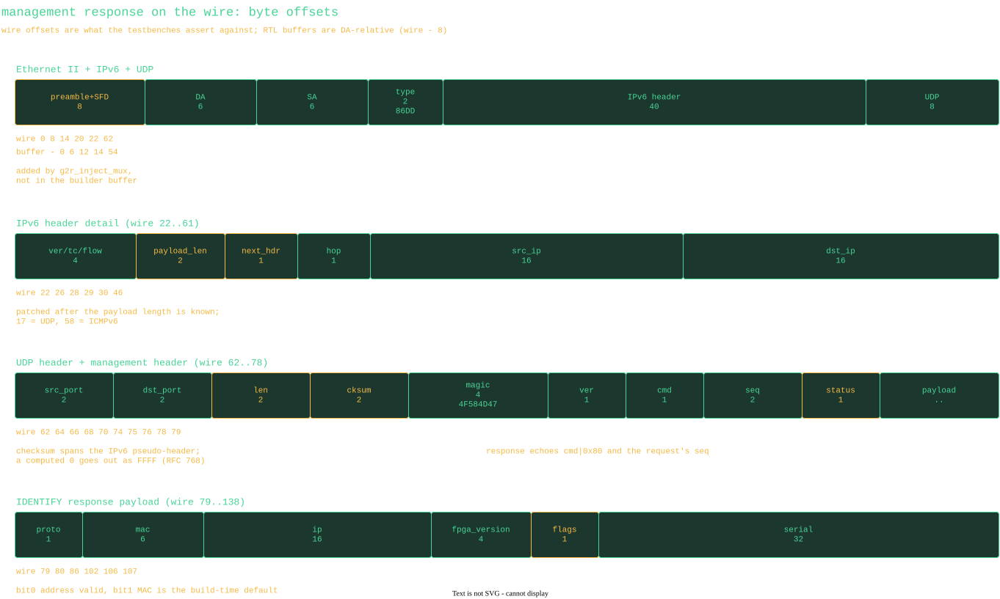
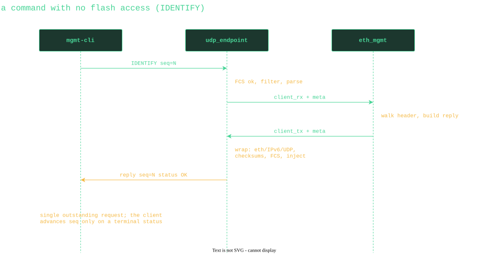
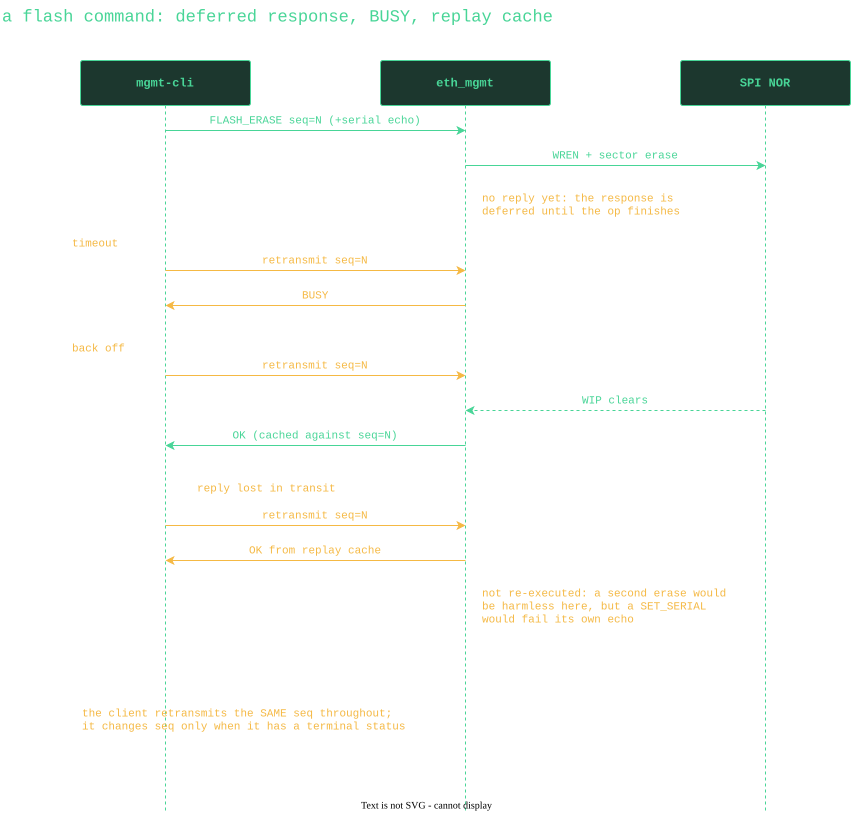
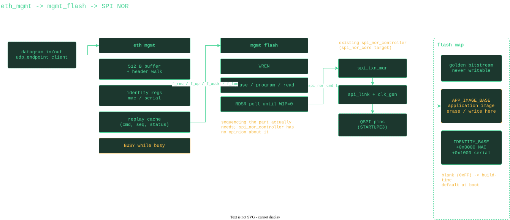

= Ethernet Management Protocol
:toc:

Normative description of the UDP management protocol spoken by the
`eth_mgmt` FPGA block and its companion CLI. Both implementations code to
this document; the golden test vectors in the RTL testbenches are derived
from it.

== Transport

* UDP over IPv6, exclusively. The device listens on port *28536* (0x6F78,
  "ox"), set by the `CLIENT_UDP_PORT` generic of `udp_endpoint`.
* The device's address is the link-local address derived from its MAC by
  EUI-64 (fe80::, MAC with the universal/local bit inverted and ff:fe
  inserted). There is no DHCP and no other address: the device is
  reachable as soon as its MAC is settled at boot. The MAC comes from the
  identity sector in flash, or a build-time default when that sector is
  blank -- IDENTIFY reports which (see the flags byte).
* Because the address derives from the MAC, and every unprovisioned unit
  carries the same default MAC, unprovisioned units all share one address.
  Provision them one at a time: with two blank units on a link, both
  answer from the same address and both defend it against duplicate-address
  detection. Per-unit MACs and the default are allocated through the OANA
  process (RFD 174).
* Requests may be sent unicast, or to link-local all-nodes multicast
  ff02::1 (Ethernet 33:33:00:00:00:01). Multicast is how unknown devices
  are discovered: the device learns the requester's address/MAC pairing
  from the request itself and replies unicast.
* The device answers Neighbor Solicitation for its address (including DAD
  probes) and ICMPv6 echo. It never sends solicitations of its own; its
  neighbor cache is taught by the traffic it accepts. Clients must
  therefore tolerate the first packet after a long silence being answered
  without any NS/NA exchange from the device side.
* Strictly stop-and-wait: one outstanding command per device. The device
  processes one request at a time and drops frames that arrive while its
  receive path is busy; the client retransmits (same sequence number) on
  timeout. All operations are idempotent under retransmission (see
  <<caching>>).
* All multi-byte fields are big-endian.

== Request

The layout below is what the testbenches assert against. Wire offsets include
the preamble the injection mux prepends; the RTL's own buffers are DA-relative,
eight bytes lower.

[cols="1,1,4"]
|===
| Offset | Size | Field

| 0 | 4 | Magic, 0x4F584D47 ("OXMG"). Anything else is ignored silently.
| 4 | 1 | Protocol version, 0x01. Others answered with BAD_VERSION.
| 5 | 1 | Command.
| 6 | 2 | Sequence number, chosen by the client, echoed in the response.
| 8 | .. | Command-specific payload.
|===

== Response

Responses carry the same magic and version, the request's command with bit
7 set (command | 0x80), the request's sequence number, then one status
byte at offset 8 and any payload from offset 9.

[cols="1,2,4"]
|===
| Code | Name | Meaning

| 0x00 | OK              | Command completed.
| 0x01 | BAD_VERSION     | Unsupported protocol version.
| 0x02 | BAD_CMD         | Unknown command byte.
| 0x03 | BAD_SERIAL_ECHO | Serial echo did not match the device.
| 0x04 | BAD_ADDR        | Address outside the writable region / unaligned.
| 0x05 | BAD_LEN         | Length out of range or datagram too short.
| 0x06 | FLASH_ERR       | Flash operation failed.
| 0x07 | BUSY            | A flash operation is in flight; back off and retry.
|===

BUSY is the in-band flow control: while a long flash operation (sector
erase, page program) is running, any well-formed request receives an
immediate BUSY instead of silence. Clients back off (tens of milliseconds)
and retry rather than blind-retransmitting.

== Serial number

The serial is an opaque 32-byte field. Oxide devices use the form
`+###-#######:###:SSSSSSSS+` (part number, revision, RFD 219 v2 serial),
24 ASCII bytes, zero-padded to 32. The FPGA never interprets it; format
validation is the CLI's job. Altering commands must echo the device's
*current* serial in full as an anti-footgun; there is no cryptographic
protection.

== Commands

[cols="1,2,4,4"]
|===
| Cmd | Name | Request payload (from offset 8) | OK response payload (from offset 9)

| 0x01 | IDENTIFY    | none | proto_ver(1), mac(6), ip(16), fpga_version(4), flags(1), serial(32)
| 0x02 | SET_SERIAL  | serial_echo(32), new_serial(32) | none
| 0x03 | SET_MAC     | serial_echo(32), new_mac(6) | none
| 0x04 | FLASH_ERASE | serial_echo(32), addr(4) | none
| 0x05 | FLASH_WRITE | serial_echo(32), addr(4), len(2), data(len) | none
| 0x06 | FLASH_READ  | addr(4), len(2) | data(len)
|===

* IDENTIFY `ip` is the device's link-local address; `flags` bit 0 = the
  address is valid (MAC settled), bit 1 = the MAC is the build-time
  default because the flash identity sector is blank (the unit is
  unprovisioned). IDENTIFY sent to ff02::1 doubles as discovery.
* SET_SERIAL takes effect immediately: the very next command must echo the
  *new* serial. A retransmission of the SET_SERIAL itself is answered from
  the result cache (<<caching>>).
* SET_MAC takes effect at the next reset (the live MAC, and therefore the
  link-local address, is left undisturbed until then).
* FLASH_ERASE: one 4 KiB sector; `addr` must be sector-aligned and inside
  the application image region, else BAD_ADDR. The response is sent when
  the erase completes (typically ~50 ms; expect BUSY meanwhile).
* FLASH_WRITE: 1..256 bytes, must not cross a 256-byte page boundary, and
  must lie inside the application image region. Erase first; programming
  only clears bits.
* FLASH_READ: 1..256 bytes, unrestricted address (used for verify and for
  reading identity sectors).

== Exchanges

A command that touches no flash completes in one round trip:

A flash command does not: its response is deferred until the operation
finishes, anything arriving meanwhile is answered BUSY, and a retransmission
after completion is answered from the replay cache rather than re-executed.

[[caching]]
== Result caching and idempotency

The device caches the (command, sequence, status) of the most recently
*completed* altering command (SET_SERIAL, SET_MAC, FLASH_ERASE,
FLASH_WRITE). A request matching the cached command and sequence is
answered with the cached status without re-execution. Clients therefore
retransmit with the *same* sequence number until they get a terminal
status, and bump the sequence for each new command. IDENTIFY and
FLASH_READ are naturally idempotent and always re-execute.

== Flash memory map

`eth_mgmt` owns the protocol; `mgmt_flash` owns the erase/program/poll
sequencing the NOR part requires, on top of the existing
`spi_nor_controller` engine.

The SPI NOR is also the FPGA configuration flash. Concrete offsets are
project generics (`APP_IMAGE_BASE`, `APP_IMAGE_SIZE`, `IDENTITY_BASE`);
the layout contract is:

[cols="2,4"]
|===
| Region | Contents

| 0x0 .. | Golden bitstream. Never writable over Ethernet; a failed or
interrupted application update falls back to it via the FPGA's multiboot
mechanism.
| APP_IMAGE_BASE .. +APP_IMAGE_SIZE | Application bitstream; the only
region FLASH_ERASE / FLASH_WRITE will touch.
| IDENTITY_BASE | Two 4 KiB sectors: MAC (6 bytes) at +0x0000, serial
(32 bytes) at +0x1000. An erased (all 0xFF) field falls back to the
hard-coded default at boot. Written only via SET_MAC / SET_SERIAL.
|===

== Client procedure sketches

* *Sockets*: AF_INET6, bound to the management network interface;
  link-local destinations require the interface scope (e.g.
  `fe80::...%eth2`, sin6_scope_id). The CLI therefore takes an
  `--interface` argument.
* *Discover*: send IDENTIFY to `ff02::1%ifname`, collect replies for
  ~1 s, key devices by serial.
* *Update image*: for each 4 KiB sector of the padded image: FLASH_ERASE,
  then 16x FLASH_WRITE of 256 bytes, each stop-and-wait with retry on
  timeout and backoff on BUSY. Then verify with FLASH_READ (or spot-check)
  and reboot the device into the new image.
