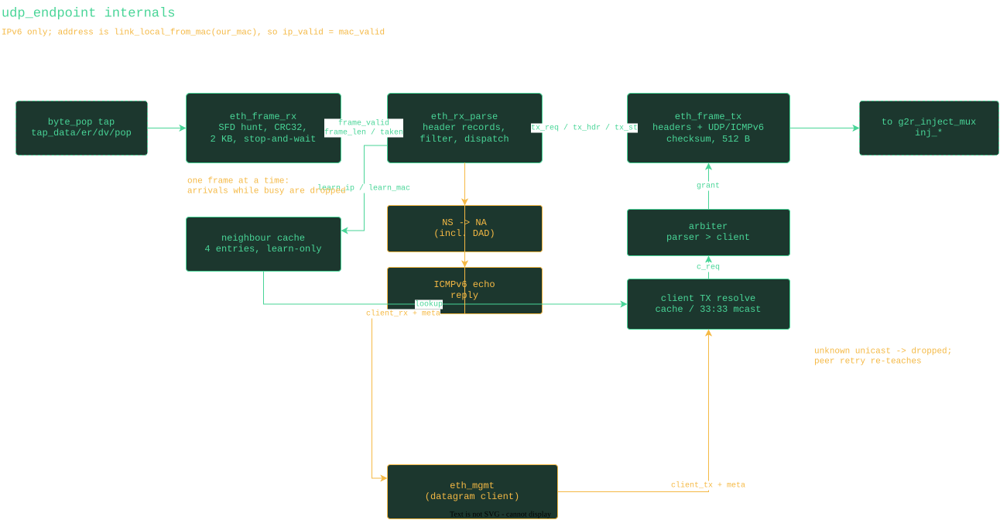

= udp_endpoint

A minimal, reusable IPv6 network endpoint that rides on the SGMII<->RGMII
bridge datapath. It taps the deduplicated RGMII RX byte stream (the
`byte_pop` output of `r2g_expander`), answers Neighbor Solicitation and
ICMPv6 echo itself, and delivers/accepts UDP datagrams on one configured
port through a generic stream interface, so an attached protocol block
(for example `eth_mgmt`) needs no knowledge of addresses, headers, or
checksums.

The endpoint's address is the link-local address derived from its MAC by
EUI-64, so there is no acquisition protocol at all: `ip_valid` simply
tracks `mac_valid`. Discovery of unknown devices works by sending to
all-nodes multicast ff02::1, which is always accepted on the client port;
the reply goes unicast using the pairing learned from the query itself.

Responses re-enter the wire on the SGMII->RGMII (g2r) direction through
`g2r_inject_mux`, which arbitrates against forwarded traffic buffered in
`gmii_pkt_buf`. Forwarded traffic always has priority; a response is only
injected at a frame boundary after a full inter-frame gap. The mux wraps
responses in preamble/SFD, pads to the 60-byte minimum, and appends the
FCS. Everything runs in the 125 MHz bridge clock domain and works at
10/100/1000 (the endpoint operates on logical octets; replication is
confined to the datapath edges).

== Client interface

Types live in `udp_endpoint_pkg`. Streams are `udp_st_t {data, valid, last}`
records with a separate `ready` travelling the other way; a byte transfers
on a rising edge where valid and ready are both high.

* RX: `client_rx` + `client_rx_meta` (`src_ip`, `src_port`, `dst_port`,
  `length`), metadata stable for the whole datagram.
* TX: `client_tx` + `client_tx_meta` (`dst_ip`, `dst_port`, `src_port`);
  payload length is discovered from `last`. Ethernet and IPv6 headers and
  the UDP checksum (which spans the IPv6 pseudo-header) are generated by
  the endpoint, as is the FCS.

== Deliberate corner cuts

The goal is the smallest logic that a management responder needs, not a
general stack:

* Strictly stop-and-wait: one frame is captured and processed at a time;
  frames arriving while busy are dropped. Clients must be idempotent and
  retry (the management protocol is).
* No Neighbor Solicitations are ever generated. A 4-entry cache learns
  IP->MAC from accepted inbound frames (the NDP source link-layer option
  when present, else the Ethernet source); TX to an unknown unicast
  address is silently discarded and the peer's retry re-teaches the
  cache. Multicast TX maps algorithmically to 33:33: MACs.
* NDP is reply-only: NS for our address is answered with an NA
  (solicited+override, target link-layer option); a DAD probe
  (unspecified source) is answered to all-nodes with the solicited flag
  clear. We do not perform DAD ourselves (the address derives from a MAC
  assumed unique), send no Router Solicitations, and speak no MLD --
  switches with MLD snooping may not forward solicited-node multicast,
  but discovery and learned-cache replies never depend on it.
* L4 receive checksums are not verified -- the FCS already gated the
  frame. TX checksums are always generated correctly.
* No extension headers (next header must be UDP or ICMPv6), no fragments,
  all-nodes ff02::1 is the only multicast group honored for UDP, NDP
  hop-limit-255 validation is skipped, only the first NDP option is
  examined, ICMPv6 echo answered only up to 400 bytes of IPv6 payload.

== Blocks

[cols="1,3"]
|===
| `eth_hdr_pkg`      | header records (`eth_header_t`, `ipv6_header_t`, `udp_header_t`) with pack/unpack, ICMPv6/NDP constants, the link-local/solicited-node/multicast-MAC address helpers, and internet-checksum helpers
| `udp_endpoint_pkg` | client stream/metadata records, endpoint status, internal builder request record
| `eth_frame_rx`     | one-frame capture from the tap with FCS check
| `eth_rx_parse`     | header walk, filtering, NDP/echo responders, datagram dispatch
| `eth_frame_tx`     | response builder: headers from records, UDP/ICMPv6 checksum generation over the pseudo-header
| `udp_endpoint`     | top: the above plus neighbor cache and builder arbitration
| `gmii_pkt_buf`     | forward-path elastic packet buffer (instantiated by the bridge wrapper)
| `g2r_inject_mux`   | forward/inject arbiter, preamble+FCS+replication (instantiated by the bridge wrapper)
|===

`sims/udp_endpoint_tb` exercises the whole thing end to end -- NS/NA
(including DAD defense), ICMPv6 echo, client datagram echo unicast and via
all-nodes discovery, transparent forwarding under injection at 1000M and
100M, and FCS rejection -- through independently-computed reference frames
(`sims/eth_sim_pkg`).
