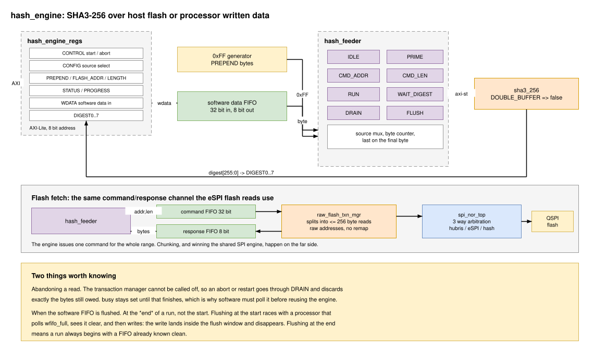

:showtitle:
:toc: left
:numbered:
:icons: font
:revision: 1.0
:revdate: 2026-08-05

= SHA3-256 hashing engine

Wraps the `sha3_256` core in an AXI-Lite register interface and the state machines
needed to feed it. It hashes either a range of the host QSPI flash or data written
in by the processor, optionally prefixed with a run of `0xFF` bytes, and presents
the result in eight read-only registers.

The intended use is measurement: hashing a host flash image, or a manifest, so
software can compare the result against something it trusts.

== Design Overview:

Flash bytes are fetched over a command/response FIFO channel in the same shape as
the eSPI flash channel: a 32-bit command FIFO taking an address word then a length
word, and an 8-bit response FIFO of data bytes. Those FIFOs belong to the
integrating design, exactly as they do for eSPI, and the far end is a second
client port on `spi_nor_top`.

The engine issues a single command for the whole range. Splitting it into the
256-byte reads the flash can actually service happens in `raw_flash_txn_mgr` on
the far side and is invisible here.

=== Why a second client port rather than sharing the eSPI one

`espi_flash_txn_mgr` applies the SP5 image and APOB address translation and is
gated by `spicr.sp5_owns_flash`. Both are right for the host's view of the flash
and wrong for a client that was handed a physical address to measure. The new
client uses raw addresses and works regardless of who owns the flash.

The cost is that a hash read locks the SPI engine for its whole duration, which
for a full image is a long time. Arbitration in `spi_nor_top` is a held grant: the
hash client takes the engine only when it is idle and nothing else has work
queued, and keeps it until the command completes. When the engine is not asking,
the selection collapses to the original two-way `sp5_owns_flash` mux, so existing
behaviour is unchanged. Measurement is expected to run while the host is not
booting.

== Interface

An 8-bit (256-byte) responder window, which is what `resize_axil` supports.

[cols="1,1,4"]
|===
|Offset |Register |Description

|0x00 |`CONTROL` |`start[0]` and `abort[1]`, both self-clearing, so this reads back
as zero. Writing `start` while a hash is running restarts it.
|0x04 |`CONFIG` |`source[3:0]`: `LOCAL_REG` (0) or `HOST_QSPI` (1). Four bits so
more sources can be added. An unsupported value decodes as `LOCAL_REG`.
|0x08 |`PREPEND` |Number of `0xFF` bytes fed before any source data. Counts towards
`LENGTH`.
|0x0C |`FLASH_ADDR` |Raw flash byte address of the first fetched byte. Not
remapped. `HOST_QSPI` only.
|0x10 |`LENGTH` |Total bytes to hash, *including* the prepended `0xFF` bytes. Bytes
taken from the source are `LENGTH - PREPEND`.
|0x14 |`STATUS` |`busy[0]`, `done[1]`, `wfifo_full[2]`, `wfifo_empty[3]`,
`aborted[4]`, `cfg_err[5]`.
|0x18 |`WDATA` |Writing pushes four message bytes into the software data FIFO,
least significant byte first.
|0x1C |`PROGRESS` |Bytes fed into the core so far for the run in flight.
|0x20-0x3C |`DIGEST0`..`DIGEST7` |The 256-bit digest.
|===

Configuration is sampled when a start is accepted, so changing `CONFIG`,
`PREPEND`, `FLASH_ADDR` or `LENGTH` mid-hash does not affect the run in flight.

=== Byte order

`DIGESTn` is `digest(32n+31 downto 32n)`, so *`DIGEST0` bits 7:0 are hash byte 0* --
the leftmost byte of the conventional hex string. Worked example, for
`sha3-256("abc")`:

----
3a985da74fe225b2045c172d6bd390bd855f086e3e9d525b46bfe24511431532
----

reads back as `DIGEST0 = 0xa75d983a` and `DIGEST7 = 0x32154311`.

`WDATA` follows the same convention: `data(7 downto 0)` is consumed first.
`LENGTH` decides where the message ends, so unused trailing bytes of the final
word are simply never consumed and no byte-enable is needed.

=== Software flow

. Write `CONFIG`, `PREPEND`, `LENGTH` and, for `HOST_QSPI`, `FLASH_ADDR`.
. Write `CONTROL.start`.
. For `LOCAL_REG`, write `LENGTH - PREPEND` bytes to `WDATA`, polling
  `STATUS.wfifo_full` before each write.
. Poll `STATUS.done`, then read `DIGEST0`..`DIGEST7`.

`done` means the engine is also idle and ready to run again, not merely that the
digest exists.

After an abort, poll `STATUS.busy` until it clears before starting anything else.
An abort during a flash read is not instantaneous -- see below.

=== Rejected configurations

A start is refused, `cfg_err` is set and `busy` never asserts, if:

* `LENGTH` is zero. AXI-Stream has no zero-beat packet, so the core cannot express
  the empty message. Software needing `SHA3-256("")` should use the known constant
  `a7ffc6f8bf1ed76651c14756a061d662f580ff4de43b49fa82d80a4b80f8434a`.
* `PREPEND` is greater than `LENGTH`.

`cfg_err` clears on the next accepted start.

== Two things that are not obvious

=== Abandoning a flash read

The transaction manager on the far side cannot be called off part way through, so
the bytes it still owes would leak into whatever ran next. Rather than try to stop
it, an abort or a restart goes through a `DRAIN` state that discards exactly the
number of bytes outstanding, then continues.

This is why `busy` stays asserted after an abort until the channel is
resynchronised, and why software must poll it rather than assuming the abort took
effect immediately.

The engine does not flush the response FIFO. Draining is what resynchronises the
channel, and resetting the FIFO instead would be worse than useless: on a restart
the next read begins within a few cycles, and the backend's first bytes would land
while the FIFO was still recovering from reset, where they are silently dropped
and the hash hangs waiting for them. The integrator should tie that FIFO's reset
to the global reset only.

=== When the software data FIFO is flushed

At the *end* of a run, not the start.

Flushing as a run starts is the obvious choice and it is wrong. A processor that
polls `wfifo_full`, sees it clear, and then writes can have its write land inside
the flush window, where it is silently dropped. Flushing at the end means a run
always begins with a FIFO that is already known clean, and there is no window to
race with. It also means data written before the very first start is kept, so
pre-loading works.

`wfifo_full` reads as set during the flush, so a processor that polls is safe
either way.

== Sim Env

Two testbenches.

`hash_engine_tb`:: The engine on its own, with `fake_flash_responder` servicing the
command/response channel out of a deterministic address-keyed pattern. This is
where the behaviour lives: both sources, all the padding-relevant lengths, the
prepend, abort, restart, back-to-back runs, the rejected configurations,
backpressure, and the published vectors as `nist_vectors`. Seventeen cases.

`hash_spi_nor_tb`:: The engine driving a real `spi_nor_top` over a real QSPI link
into a modelled flash part (`spi_nor_target_vc`), with the same launch and capture
delays `spi_nor_th` uses. The part is filled with `pattern_byte(addr)`, which is a
bijection over any aligned 256-byte run, so the digest depends on exactly which
addresses were fetched -- a chunk boundary that re-reads or skips a range changes
the digest instead of going unnoticed. Covers the exact-256 boundary, one byte
either side of it, unaligned bases, multi-chunk reads, and the sector-bypass
configuration the hardware script drives.

Two bugs came out of testing at this level that nothing else caught:

* `raw_flash_txn_mgr` inherited the eSPI manager's mixed zero-indexed and
  one-indexed counting, and decremented its remaining count by the zero-indexed
  chunk size rather than by the bytes the chunk actually moves. That over-fetches
  one byte per extra chunk -- 5000 bytes requested fetched 5019. It is invisible in
  the eSPI manager because an eSPI flash read never needs a second chunk. Both
  counts are now plain byte counts.
* `spi_cmd.addr` and `spi_cmd.data_bytes` must hold still for the whole
  transaction. `spi_txn_mgr` shifts the address out during the address phase and
  re-reads `data_bytes` when it enters the data phase, so advancing either at
  `go_flag` corrupts the transaction already in flight. The next chunk's address
  is parked in `next_addr` until the current one retires.
* `go_flag` has to be held until the controller actually takes it. Leaving
  `issue_read` on `spi_hw_busy = '0'` looks right and is not: the controller
  enforces a minimum `cs_n` high time between transactions and ignores `go_flag`
  until it expires, whereas `spi_hw_busy` drops the moment `cs_n` rises. Exiting
  on that turns `go_flag` into a one-cycle pulse inside the dead window, the
  command is dropped, and every chunk after the first is stranded. The first
  chunk survives because the controller has been idle long enough for the window
  to have expired already, which is exactly why single-chunk reads passed
  throughout.

A third came out of the sector-bypass case specifically. The flash command used to
be issued as soon as a run started, before any of the 0xFF prepend had been fed.
The backend begins fetching the moment the command lands and has no way to be told
to wait, so with a 4 KiB prepend the response FIFO filled while the engine was
still feeding 0xFF and everything past its depth was dropped -- `wfull` on that
FIFO is not wired anywhere. The hash then waited forever for data that had been
thrown away. The command is now issued only once the prepend has been fed, which
costs one flash latency and removes the window entirely. Note this is exactly the
configuration the hardware script uses, so it was worth having a test for.

[WARNING]
====
The `go_flag` problem is not confined to this block. `espi_flash_txn_mgr` has the same
`if spi_hw_busy = '0'` exit and the same chunking arithmetic, so an eSPI flash
read longer than 256 bytes would over-fetch and then strand itself. It is latent
today only because hosts request small payloads -- the RTL accepts a 12 bit
length, so up to 4096 bytes, which is sixteen chunks. Left alone here rather than
changed blind on a boot path with no multi-chunk test to regress it against.
====

Every expected digest in both testbenches is computed by `sha3_sim_pkg`'s software
sponge over a queue built to match, so none of them is a transcribed constant. The
SHA3 core itself is not under test here; `keccak_pkg_tb` anchors that against
published vectors.

== Testing on hardware

`tools/hash_engine_flash_test.py` drives the host-flash path on a real board over
the FMC bus, using humility's `FmcDemo.peek32` and `poke32`. Give it the ROM image
that is programmed into the host flash and it configures the engine, waits for the
digest and compares it against one computed in software:

[source,bash]
----
./tools/hash_engine_flash_test.py --rom cosmo-host.bin

./tools/hash_engine_flash_test.py --rom img.bin --dry-run    # show the pokes only
./tools/hash_engine_flash_test.py --selftest                 # arithmetic, no board
----

`tools/hash_engine_vectors_test.py` runs the published SHA3-256 vectors from
https://di-mgt.com.au/sha_testvectors.html through the manual path instead, with
`CONFIG.source = LOCAL_REG` and the message written a word at a time into `WDATA`.
That measures the engine against the standard rather than against our own model of
it, and touches none of the flash machinery:

[source,bash]
----
./tools/hash_engine_vectors_test.py
./tools/hash_engine_vectors_test.py --selftest        # table vs hashlib, no board
./tools/hash_engine_vectors_test.py --include-million  # hours: 250,000 writes
----

Three of the six vectors are special. The empty message cannot be expressed on an
AXI stream, so the script checks the engine *rejects* `LENGTH = 0` with `cfg_err`
rather than skipping it. The million byte vector is 250,000 register writes, each
a separate humility process, so it is behind a flag. The ~1 GB vector is never run.

The same three short vectors are also checked in simulation, as `nist_vectors` in
`hash_engine_tb`, so the expectations the script carries are known good against the
RTL before any board is involved.

=== Sector bypass

The first sector of the host flash is not part of what is being measured, so it is
hashed as a run of `0xFF` instead of as whatever the part actually holds. There is
no dedicated register for this -- it falls out of two that already exist:

[source]
----
PREPEND    = sector size    feed this many 0xFF bytes first
FLASH_ADDR = sector size    then start fetching one sector in
LENGTH     = image size     total, counting the 0xFF run
----

which makes the message `0xFF * sector` followed by the image from the second
sector on. The script builds its expected digest the same way from the ROM file,
so the two agree by construction. `--sector-size` defaults to 0x1000, matching
`SECTOR_BYTES` in the SPI NOR verification component; override it if the part in
use differs. `--no-bypass` hashes straight through from offset 0 for comparison.

If `FmcDemo.peek32` wants absolute STM32 addresses rather than FPGA-relative ones,
pass the window base with `--base`.

=== Running

[source,bash]
----
buck2 run //hdl/ip/vhd/hash_engine:hash_engine_tb
buck2 run //hdl/ip/vhd/hash_engine:hash_spi_nor_tb

# a single test case is selected positionally, not with --test-case
buck2 run //hdl/ip/vhd/hash_engine:hash_engine_tb -- "*abort_midway*"

# the SPI controller regression, which the new client port touches
buck2 run //hdl/ip/vhd/spi_nor_controller:spi_nor_top_sim
----

== Not done yet

The block is not wired into any project. Integrating it needs a responder entry in
the project's `config_array`, a matching `addrmap` line in the top-level `.rdl`,
and the two FIFOs between the engine and `spi_nor_top`'s new client port -- the
same pattern `sp5_espi_flash_subsystem` uses for eSPI.

A real SPI NOR device model would let `hash_spi_nor_tb` check content-dependent
behaviour rather than a run of `0xFF`. The tree has wanted one for a while;
`spi_nor_tb` says as much.
