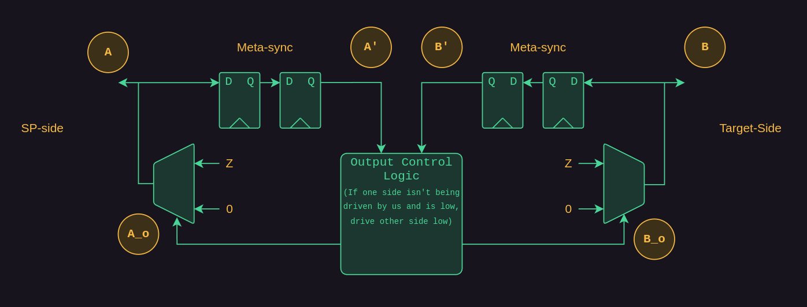
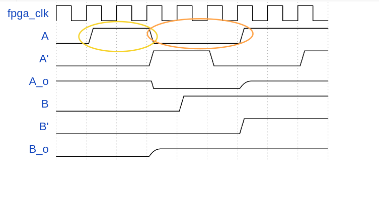

:showtitle:
:toc: left
:numbered:
:icons: font
:revision: 1.0
:revdate: 2025-01-14

= FPGA I2C Mux
This mux design emulates most of the functionality of a PCA9545ABS
with the following changes/enhancements:

hw-enforced single channel selection.  Commands that would result on multiple legs
of the mux to be enabled in an real PCA9545ABS will result in NACKs and no change
in current state.

We have increased the number of channels to 16, which means that there are now two
8-bit control registers instead of one 8-bit register.

== Background/Motivation

Seemingly with some regularity one of us has the bright idea to "just use the FPGA"
as an i2c mux.  At the surface, this seems surprisingly elegant, but as you dig
in to the details carefully, it becomes obvious that it may be challenging to 
do this reliably in a completely generic way, especially with target devices that
are allowed to clock-stretch, though there are some other challenging cases as well.
Some of these could be further mitigated by giving the FPGA more knowledge of the 
packet shapes running through it, but that again becomes difficult to do generically
given the variety of i2c devices and packet formats out there.

When thinking through the implementation of FPGA-based I2C muxes, I discovered that there are likely to be glitches on both SDA and SCL lines when there are bi-directional changes in the signalling.

The same cases technically apply for SDA during bus-turnaround also, but I think matter less since the device shouldn't be sampling at these times.

While the logic to implement this at first blush is deceptively simple, there are some potential pitfalls worth looking at.
As a strawman for the discussion, here's a simplified logic diagram of the tri-state buffers and basic FPGA implementation:

Probe points are annotated with the yellow circles to line up with the waveforms below.
In all the cases below, we're assuming our logic supports stretching, which effectively means we immediately connect B' to A_o as soon as we detect A is no longer driving the bus (which really means looking at A'). We also assume the FPGA clock is fast enough that the minor phase delay doesn't matter for i2c, which I think is a reasonable assumption.

Case 1, A side releases SCL, B side is not stretching:

Notably, we see a high "glitch" for ~3 FPGA clocks (yellow) and then a low "glitch" for ~4 FPGA clocks. Note that this is idealized input response too, real-world this low glitch could be longer due to rise-time physics and metastability effects when waiting for B to float up.

Case 2, A side releases SCL, B side does stretch

We see the same high "glitch" for ~3 FPGA clocks (yellow) , but since we're stretching there's no low glitch in this scenario.

STM32 is the only controller on these busses and has a minimum of a 50ns analog glitch filter so any of these glitches would be filtered out by it so long as we make the FPGA clocks fast enough.

In general, this feels a bit concerning given the criticality of everything just working, especially with devices that
we don't control on the bus.

* We'll see glitching behavior on SCL when clock stretching must be supported.

* We'll see glitching generally on SDA during turn-around phases.

Neither of these properties lend themselves to reliable i2c bus operation and debug.

== Implementation Path

Given that i2c muxing in an FPGA is a bad idea, this design relies on external
analog muxes like TMUX131 as well as an FPGA endpoint that controls the select
lines to these external TMUX devices, giving the appearance to software of in-band
mux control while retaining some additional control in the FPGA and providing possible
system side-band control of these muxes with more feedback than we get from just a reset
line and an OTS in-band mux.