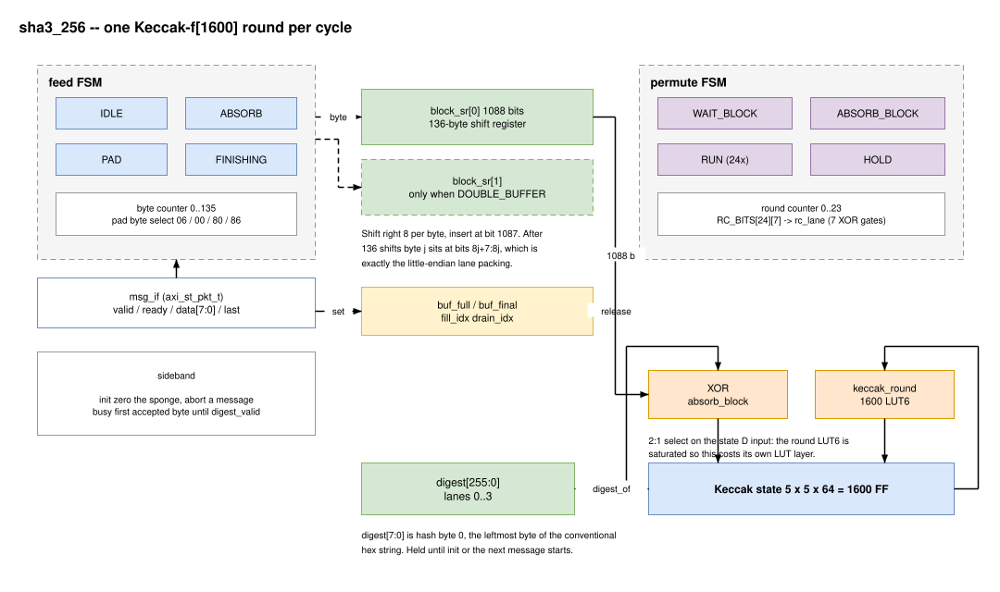
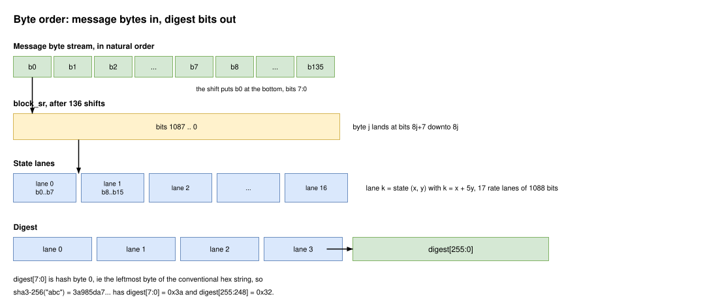
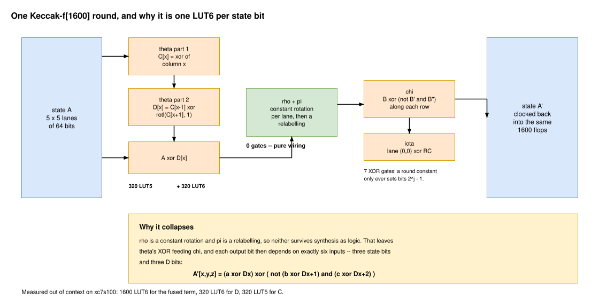
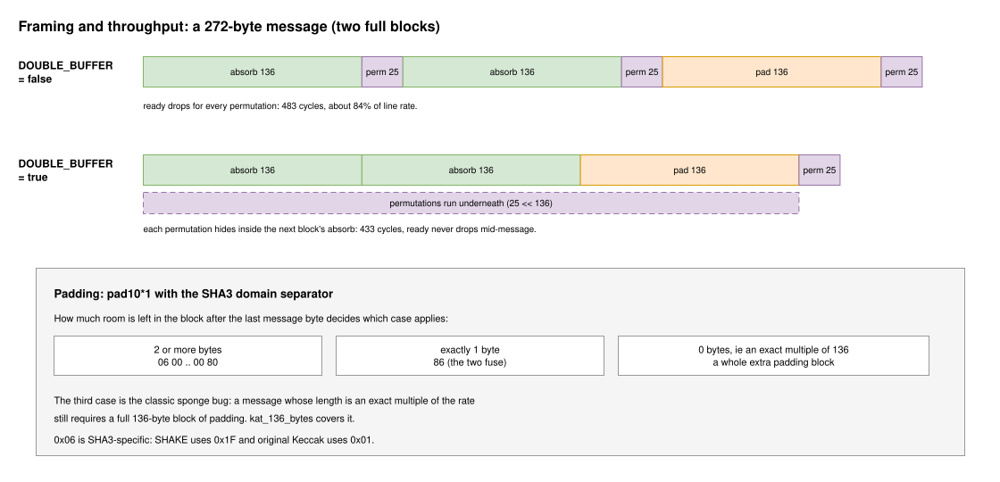

:showtitle:
:toc: left
:numbered:
:icons: font
:revision: 1.0
:revdate: 2026-08-05

= SHA3-256 hashing engine

A synthesizable SHA3-256 (FIPS 202) core with a byte-wide AXI streaming input and
a parallel 256-bit digest output. It is intended for things like measured boot,
flash-image attestation and manifest verification, where an FPGA needs a hash of
something it can already see on a bus.

The sponge parameters are fixed: state `b` = 1600 bits, capacity `c` = 512 bits,
so the rate is 1088 bits = 136 bytes = 17 lanes, and the permutation is 24 rounds
of Keccak-f[1600]. The 256-bit digest is four lanes, which fits inside a single
rate block, so this core never needs a squeeze permutation.

== Design Overview:

The permutation runs *one full Keccak round per cycle*. The 1600-bit state is
therefore read and rewritten in its entirety every cycle, which means it lives in
flops -- no on-chip RAM is used, or would help. That choice is deliberate: with a
byte-wide input, absorbing a block costs 136 cycles against the permutation's 25,
so the stream is the bottleneck and there is nothing to buy by making the
permutation smaller and slower. A plane-serial datapath at five cycles per round
would use roughly half the LUTs and still keep up, but it needs phase-aligned
parity registers and is far easier to get subtly wrong; it is worth revisiting
only if this ever has to fit a much smaller part.

The core is two independent state machines that share nothing but a per-buffer
handshake:

feed FSM:: Owns `msg_if.ready`, the byte counter, pad-byte generation and
`fill_idx`. It shifts bytes into a 136-byte block register and marks it full when
complete.

permute FSM:: Owns the Keccak state, the round counter and `drain_idx`. It waits
for a full block, XORs it into the state, runs 24 rounds, and hands the buffer
back.

Splitting them this way is what makes `DOUBLE_BUFFER` a one-line change rather
than a second code path. The buffer release is combinational rather than
registered, because the feed side has to observe it in the same cycle the final
round retires; if it were a cycle late, a single-buffered core would absorb the
same block twice.

=== Absorb path

Incoming bytes are *shifted* into a 1088-bit register, not written to an addressed
lane. Addressing would need a 17-way decode and byte enables across 1088 state
bits for no saving, whereas the shift is pure wiring and the XOR into the state is
then a flat slice with no muxing at all.

The consequence is that a byte's final position is fixed by how many shifts follow
it, so every block must receive exactly 136 shifts. That is why padding shifts
filler bytes through one per cycle rather than writing the terminator directly. It
costs up to 136 cycles once per message, which is irrelevant next to the 136
cycles the message itself takes to arrive.

== Interface

[cols="1,1,4"]
|===
|Generic |Type |Description

|`DOUBLE_BUFFER` |boolean
|`false` (default) uses one block register and `ready` drops for each 25-cycle
absorb-and-permute, giving about 84% of line rate. `true` adds a second block
register (+1088 FF) so block N+1 absorbs while block N permutes; `ready` then
never drops mid-message. The permutation cannot fall behind because 25 < 136.
|===

[cols="1,1,4"]
|===
|Port |Direction |Description

|`clk` |in |Clock.
|`reset` |in |Asynchronous, active high.
|`init` |in |Synchronous, active high. Zeroes the sponge, abandons any message in
flight and clears `digest_valid`. The core is held cleared for as long as it is
asserted, so a pulse or a level both work. Not required between messages -- `last`
already ends one cleanly.
|`busy` |out |High from the first accepted byte until `digest_valid` asserts.
|`msg_if` |view |`axi_st_pkt_sink` from `axi_st8_pkg`: `valid` / `ready` /
`data[7:0]` / `last`. Message bytes in natural order, `last` marks the final byte.
|`digest` |out |256-bit digest, see byte order below.
|`digest_valid` |out |Level. Held until `init` or until the next message claims its
first byte.
|===

This is the first user of `axi_st_pkt_t` in the tree; the record was defined in
`axist_if_2k19_pkg` but had no users. Because it relies on VHDL-2019 mode views,
`sha3_256` is declared `standard = "2019"`, which propagates to everything that
depends on it.

=== Byte order

Byte order is the easiest thing to get wrong when integrating a hash, so it is
defined in exactly one place, `digest_of` in `keccak_pkg`:

*`digest(7 downto 0)` is hash byte 0*, that is the leftmost byte of the
conventional hex string. So `sha3-256("abc") = 3a985da7...1532` gives
`digest(7 downto 0) = 0x3a` and `digest(255 downto 248) = 0x32`.

On the input side, rate lane `k` absorbs message bytes `8k` through `8k+7`
little-endian, per FIPS 202 B.1, and lane `k` is state element `(x, y)` with
`k = x + 5y`.

=== Limitations

AXI streaming has no zero-beat packet, so *the empty message is not representable*
on this interface -- there is no way to assert `last` without also presenting a
byte. A consumer that needs `SHA3-256("")` should use the known constant
`a7ffc6f8bf1ed76651c14756a061d662f580ff4de43b49fa82d80a4b80f8434a`.

There is no `enable` port. The stream's `valid` already gates all forward
progress, and a real clock enable would fan out to every one of the ~3000 flops
for no benefit.

== Round function

`keccak_round` in `keccak_pkg` is a pure function, so the same code is both the
synthesizable next-state logic and the testbench's round primitive -- the same
idea as `lfsr8_pkg`.

The reason a full round fits in one cycle cheaply is that rho and pi cost nothing:
rho is a constant rotation per lane and pi is a relabelling, so neither survives
synthesis as logic. What remains is theta's XOR feeding chi, and each output bit
then depends on exactly six inputs -- three state bits and three `D` bits:

----
A'[x,y,z] = (a xor Dx) xor ( not (b xor Dx+1) and (c xor Dx+2) )
----

which is one LUT6 per state bit.

Both constant tables are generated at elaboration rather than transcribed:

* *rho offsets* are walked out of the standard recurrence. Starting from `(1,0)`,
  the `t`-th lane visited gets offset `(t+1)(t+2)/2 mod 64`, stepping by the same
  pi permutation the round already uses. `keccak_pkg_tb` checks the result against
  the published table.
* *round constants* come from a Galois LFSR over `x^8 + x^6 + x^5 + x^4 + 1`. Only
  bit positions `2^j - 1` for j in 0..6 can ever be set, so they are stored as a
  24x7 ROM and scattered into a lane. That turns a 64-bit 24:1 mux into about 35
  LUTs and 7 XOR gates.

=== Measured utilization

Out of context on `xc7s100fgga484-1`, Vivado 2024.2:

[cols="2,1,1,1,1"]
|===
|Configuration |LUT |FF |BRAM |DSP

|`DOUBLE_BUFFER => false` |5349 |2989 |0 |0
|`DOUBLE_BUFFER => true`  |6187 |4077 |0 |0
|===

That is about 5% of an `xc7s100`. Timing closes comfortably: at a 5 ns period the
worst negative slack is +1.11 ns, so the critical path is around 3.9 ns, or about
257 MHz. It is three logic levels -- theta's 5-input XOR, then D, then the fused
round LUT6.

The FF delta between the two configurations is exactly 1088, the second block
register, as expected. The 838 extra LUTs are the `fill_idx`/`drain_idx` selection
across two 1088-bit buffers.

Synthesizing the round on its own confirms the fusion argument above holds in
practice: *1600 LUT6* for the fused theta-XOR, chi and iota term -- exactly one per
state bit -- plus 320 LUT6 for `D` and 320 LUT5 for the column parities `C`. The
rest of the core is the state register's input mux, which cannot fold into the
saturated round LUT6, and the 1088-bit absorb XOR.

If a future change pushes the LUT count well past this, the first thing to check
is whether theta still fuses into chi.

== Throughput and padding

Padding is pad10*1 with the SHA3 domain separator. How much room is left in the
block after the last message byte decides which case applies, and all three fall
out of writing `0x06` and then OR-ing `0x80` into the final byte:

* two or more bytes left: `06 00 .. 00 80`
* exactly one byte left: the two fuse into `86`
* no bytes left, ie the message length is an exact multiple of 136: a whole extra
  block of padding is required

That last case is the classic sponge bug and is covered by `kat_136_bytes`. Note
also that `0x06` is SHA3-specific -- SHAKE uses `0x1F` and original Keccak `0x01`.

== Sim Env

Two testbenches, deliberately separate, because they check different things.

`keccak_pkg_tb`:: Unit tests for the permutation, no RTL involved. This is the
layer that anchors the round function, the generated rho offsets and the generated
round constants against published values -- most importantly Keccak-f[1600]
applied to the all-zero state, which exercises every rotation offset and all 24
round constants and avalanches on any error in either.

`sha3_256_tb`:: The sponge and the stream interface. Expected digests come partly
from hardcoded known-answer tests and partly from `sha3_sim_pkg`, a software
sponge over a VUnit `queue_t` in the spirit of `crc_sim_pkg`.

The split matters: `sha3_sim_pkg` shares `keccak_round` with the DUT, so it cannot
detect a wrong rotation offset or round constant -- both sides would be wrong
identically. It is there to check everything the sponge wraps around the
permutation, at arbitrary message lengths that a fixed vector set cannot cover.
The known-answer tests are what pin the permutation itself.

Both buffering configurations are instantiated side by side in `sha3_256_th` and
fed the same vectors, so they cannot silently diverge. They get separate stream
sources because their backpressure differs by design; the single-buffered source
is throttled to 60% valid to exercise gaps, and the double-buffered one runs flat
out so `no_stall_is_real` can measure that it never pushes back. That test also
asserts that the single-buffered core *does* stall, so it cannot pass vacuously on
a broken observer.

`init` is driven through a `sim_gpio` instance rather than an external name, per
the usual convention in this tree.

Stimulus uses `basic_pkt_source`, added to `hdl/ip/vhd/vunit_components/basic_stream`
alongside the existing `basic_source`. It is the same component with a `last`
port, since `basic_source` cannot drive `axi_st_pkt_t`.

=== Running

[source,bash]
----
buck2 run //hdl/ip/vhd/sha3:keccak_pkg_tb
buck2 run //hdl/ip/vhd/sha3:sha3_256_tb

# a single test case is selected positionally, not with --test-case
buck2 run //hdl/ip/vhd/sha3:sha3_256_tb -- "*kat_136_bytes*"
----

Known-answer digests should be regenerated rather than copied by hand:

[source,bash]
----
python3 -c "import hashlib; print(hashlib.sha3_256(b'abc').hexdigest())"
----

`hex_digest` in `sha3_sim_pkg` parses a digest string in the conventional order,
so tests carry exactly what `sha3sum` prints rather than a hand byte-reversed
constant.
