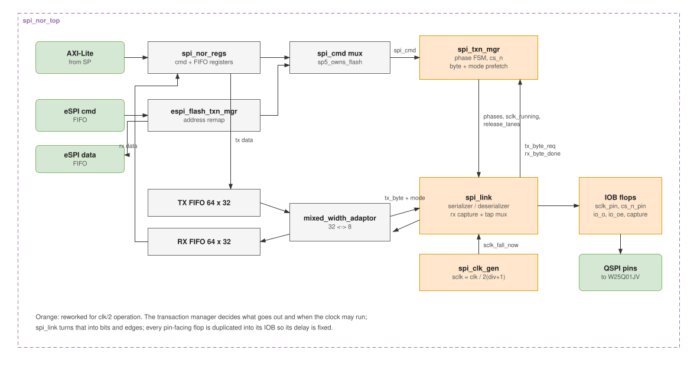
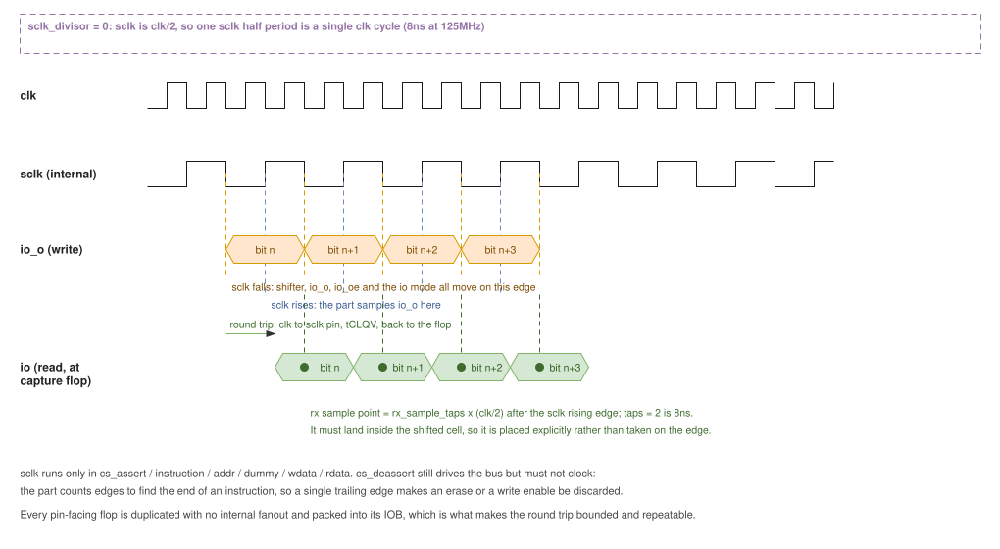

# SPI NOR controller

Drives a Winbond W25Q01JV QSPI NOR flash on behalf of two masters: the SP over
AXI-Lite, and the eSPI block fetching the host image. `SPICR.sp5_owns_flash`
picks which one owns the part.



## Software interface

Registers are generated from `spi_nor_regs.rdl`. Writing `Instr` starts a
transaction; reading `rx_fifo_rdata` pops the RX FIFO.

Write:

- (optional) reset the FIFOs via the control register
- write up to 256 data bytes into the TX FIFO, 4 bytes per access
- set the data size register to the byte count (need not be a multiple of 4)
- set the dummy register to the clock count the instruction needs
- write the instruction; the write side effect starts the transaction
- poll `SPISR.busy`

Read: as above without the FIFO fill. Either wait on `busy`, or poll
`rx_used_wds` and drain as data arrives.

The opcode alone determines the phase sequence and bus width, via
`get_txn_info` in `spi_nor_pkg`. Software supplies only the dummy count.

## Structure

| unit | role |
| --- | --- |
| `spi_nor_regs` | AXI-Lite target, command and FIFO registers |
| `espi_flash_txn_mgr` | turns eSPI read requests into commands, remaps host and APOB addresses |
| `spi_txn_mgr` | phase FSM, chip select, byte and io-mode prefetch |
| `spi_link` | serializer, deserializer, rx capture and sample-point mux |
| `spi_clk_gen` | sclk divider |
| `mixed_width_adaptor` | 32-bit FIFO side to 8-bit link side |

## Clocking and edges

`sclk = clk / (2 * (sclk_divisor + 1))`. Both projects run `sclk_divisor => 0`
off `clk_125m`, so **sclk is 62.5MHz**, a 16ns period.



Three things follow from a half period being one clk cycle, and all three are
load-bearing:

**Launch on the falling edge itself.** The shifter, `io_o`, `io_oe` and the io
mode all move on the clk edge that drives sclk low, so mosi and sclk leave the
FPGA together. Reacting to an edge detector instead spends a whole clk of the
half-period budget and caps sclk at clk/4.

**The byte and its io mode are prefetched together.** The serializer reloads on
the same edge the FSM advances a phase, so both must already be sitting there.
Taking the mode from the registered state instead means the first data byte of a
dual or quad write is loaded while the state still reads `addr`: it goes out
with single-bit lane assignment and gets shifted by one instead of four, which
leaves the shifter's sentinel where the byte-complete compare can never match
and the transaction never ends.

**Read data is sampled at a placed point, not on an edge.** The round trip out
to the part and back does not shrink with sclk, so `rx_sample_taps` selects the
sample point in half-clk steps after the sclk rising edge (default 2 = 8ns),
sourced from a rising- and a falling-edge capture flop. The point must satisfy

```
round_trip_valid - half_period  <=  S  <=  half_period + round_trip_hold
```

Note the upper limit comes from the part's tCLQX, not tCLQV: sampling too late
catches the next bit. The project XDC carries the arithmetic for the delays it
bounds.

`sclk_running` is deliberately narrower than `in_tx_phases`: `cs_deassert` still
drives the bus, so mosi is not torn down on the edge the part samples it, but it
must not clock. The part counts edges to find the end of an instruction, and a
single trailing edge makes an erase or a write enable be discarded silently.

## Physical

Every pin-facing flop is a dedicated duplicate with no internal fanout
(`sclk_pin`, `cs_n_pin`, `io_o`, `io_oe`, the rx capture) so it can be packed
into its IOB. That is what makes the round trip bounded and repeatable: left in
the fabric the placer put these 12-13ns of routing from their pins and varied by
several ns between builds, which both blew the clock-to-data skew budget and
pushed the round trip outside every available sample point.

62.5MHz is the ceiling for this structure. The sample point is placed, not
trained, so the round trip has to fit within half a period of it; above this
rate that window closes and it would take per-lane `IDELAY` read training to go
further.

## Simulation

`spi_nor_target_vc` models the part with datasheet AC timing (tCLQV, tCLQX,
tDVCH, tCHDX, tSLCH, tSHSL) and discards malformed commands the way silicon
does, so a trailing clock or a bad sample point fails a test rather than
producing a plausible waveform. The harness also models the FPGA's own
flop-to-pin and pin-to-flop delays; without them simulation validates a regime
that does not exist on hardware.

| testbench | configuration |
| --- | --- |
| `spi_nor_tb` | clk/6, the historical setting |
| `spi_nor_fast_tb` | clk/2, slow IO corner |
| `spi_nor_fast_quick_io_tb` | clk/2, fast IO corner |

The fast benches also sweep the part's output delay across its datasheet range
to show the sample point has margin at both ends.

```
buck2 run //hdl/ip/vhd/spi_nor_controller:spi_nor_top_sim
```
